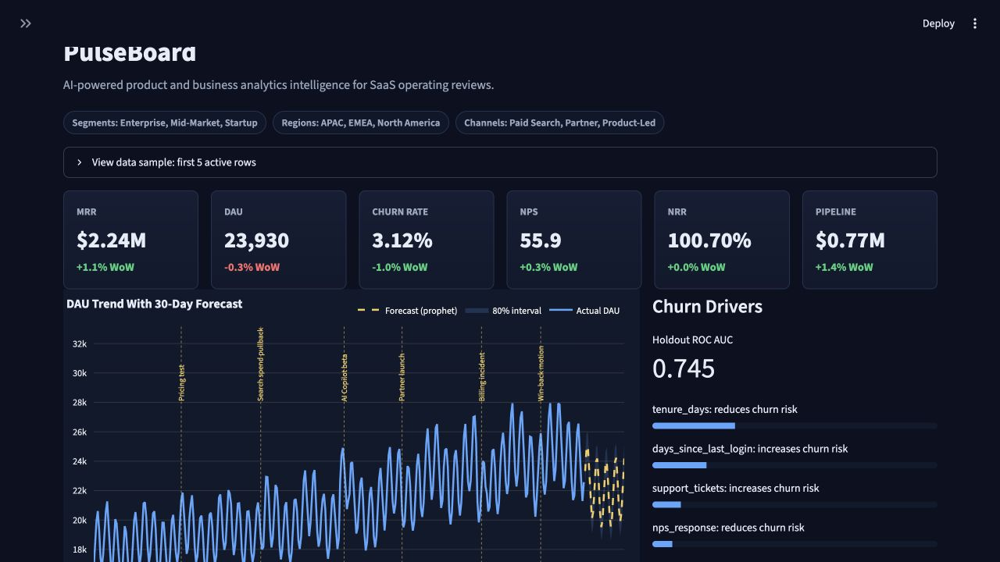
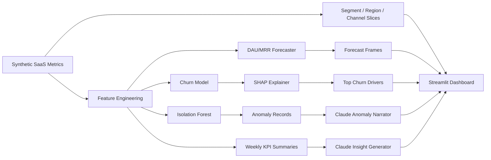

# PulseBoard

[](https://www.python.org/)
[](https://streamlit.io/)
[](https://scikit-learn.org/)
[](https://plotly.com/python/)
[](https://www.anthropic.com/)

PulseBoard is an AI-powered Product & Business Analytics Intelligence Dashboard for SaaS metrics. It generates realistic product telemetry, runs forecasting and anomaly detection pipelines, explains churn drivers with SHAP, and turns weekly KPI movement into executive-ready narratives with Claude.



Repository: [github.com/Robertcurzon/PulseBoard](https://github.com/Robertcurzon/PulseBoard)

## What It Shows

- Synthetic SaaS data with 12 months of daily DAU, MAU, signups, churn, ARPU, MRR, feature adoption, NPS, A/B variants, retention cohorts, injected KPI anomalies, and annotated business events.
- Filterable mock operating dataset across customer segments, regions, and acquisition channels so the dashboard can be used live in a portfolio walkthrough.
- ML pipeline with feature engineering, churn prediction, Isolation Forest anomaly detection, Prophet-first forecasting with a statsmodels fallback, and SHAP feature attribution.
- LLM insight generation using the Anthropic Python SDK with graceful offline placeholders when `ANTHROPIC_API_KEY` is not configured.
- Streamlit dashboard with dark executive styling, collapsible data preview, KPI cards, forecast overlays, segment mix, acquisition funnel, pipeline quality, feature adoption, anomaly narratives, cohort heatmaps, CSV upload, an AI analyst agent, and weekly insight feed.

## Architecture



## Quickstart

```bash
cd pulseboard
python -m venv .venv
source .venv/bin/activate
pip install -r requirements.txt
cp .env.example .env
streamlit run dashboard/app.py
```

Claude calls are optional. Without an API key, the app displays deterministic fallback summaries so the full dashboard remains runnable.

## Share As A Web App

PulseBoard is built for Streamlit hosting, so the easiest public demo path is:

1. Fork or use this GitHub repo.
2. Create a new app in Streamlit Community Cloud.
3. Point it at this repository, branch `main`, and app path `dashboard/app.py`.
4. Add `ANTHROPIC_API_KEY` as an app secret if you want live Claude narratives. Leave it unset for deterministic offline demo text.
5. Share the generated Streamlit app URL with colleagues.

After deployment, add the live app URL near the top of this README so recruiters and interviewers can open the dashboard directly.

The same repo also works on Render, Railway, Hugging Face Spaces, or any Python web host that can run:

```bash
streamlit run dashboard/app.py --server.port $PORT --server.address 0.0.0.0
```

## Upload Your Own CSV

Use the sidebar's **Data Source** control and choose **Upload CSV**. PulseBoard will validate the file, derive missing optional metrics where possible, and rerun the dashboard, anomaly detection, forecasting, operating charts, and AI analyst agent on the uploaded data.

Minimum CSV requirements:

- `date`
- At least one of `dau`, `mrr`, `new_signups`, `churn_rate`, or `nps`

Recommended dimensions:

- `segment`
- `region`
- `acquisition_channel`

Recommended operating metrics:

- `activated_users`, `paid_conversions`, `paid_accounts`, `churned_accounts`
- `pipeline_created`, `pipeline_won`
- `expansion_mrr`, `contraction_mrr`
- `activation_rate`, `trial_to_paid_rate`, `net_revenue_retention`
- `feature_a_adoption`, `feature_b_adoption`
- `event`, `event_category`, `event_description`

See [docs/data_format.md](docs/data_format.md) and [data/sample_upload.csv](data/sample_upload.csv).

## Agentic Features

PulseBoard includes an **AI Analyst Agent** panel. It does a small analysis pass before answering:

- scans weekly KPI deltas,
- compares segment contribution and revenue risk,
- checks anomaly/event context,
- then writes a diagnosis and recommended actions.

With `ANTHROPIC_API_KEY`, Claude synthesizes the final response. Without a key, PulseBoard uses a deterministic offline agent response so the hosted demo still works.

Good demo prompts:

- "What changed this week, and what should the business do next?"
- "Which segment is driving revenue risk?"
- "Are the anomalies explainable by product, GTM, or billing events?"
- "Where should the team focus to improve conversion?"

## Case Study Walkthrough

**Problem.** SaaS teams often have plenty of metrics but limited time to connect product usage, revenue movement, customer health, and operational incidents into an executive-ready story.

**Approach.** PulseBoard creates a realistic product analytics environment with segment, region, and acquisition-channel slices. It validates either built-in mock data or an uploaded CSV, then applies anomaly detection, forecasting, churn explanation, and LLM-generated narrative layers.

**ML and AI components.**

- Isolation Forest detects unusual KPI movement across engagement, revenue, conversion, retention, and satisfaction metrics.
- Prophet-first forecasting projects key metrics with uncertainty intervals, with robust fallbacks for short uploaded files.
- SHAP explains churn model drivers in business-readable terms.
- The AI Analyst Agent inspects KPI deltas, segment drivers, and anomaly context before producing a diagnosis and recommended actions.

**Business value.** The dashboard helps stakeholders move from "what changed?" to "what should we do next?" It is designed for weekly business reviews, product launch readouts, funnel diagnostics, revenue risk reviews, and interview conversations about how analytics products can combine ML, LLMs, and user-centered design.

## Run The ML Pipeline

```bash
cd pulseboard
python scripts/run_pipeline.py
```

The CLI prints detected anomalies, DAU/MRR forecasts, churn model metrics, SHAP drivers, and LLM/offline insight text.

## Test

```bash
cd pulseboard
pytest
```

## Tech Stack

- **App:** Streamlit, Plotly
- **Data:** pandas, NumPy
- **ML:** scikit-learn, Prophet with statsmodels fallback, SHAP
- **LLM:** Anthropic Python SDK, async request wrappers
- **Testing:** pytest, pytest-asyncio

## Repository Layout

```text
pulseboard/
├── README.md
├── requirements.txt
├── .env.example
├── config/
│   └── settings.py
├── data/
│   ├── sample_upload.csv
│   ├── ingestion/
│   │   └── csv_loader.py
│   └── generators/
│       └── synthetic_data.py
├── docs/
│   ├── data_format.md
│   └── pulseboard-screenshot.png
├── ml/
│   ├── pipeline.py
│   ├── anomaly_detector.py
│   ├── forecaster.py
│   └── explainer.py
├── llm/
│   ├── insight_generator.py
│   ├── anomaly_narrator.py
│   ├── analyst_agent.py
│   └── prompt_templates.py
├── dashboard/
│   ├── app.py
│   ├── components/
│   │   ├── kpi_cards.py
│   │   ├── trend_charts.py
│   │   ├── anomaly_panel.py
│   │   ├── cohort_heatmap.py
│   │   ├── agent_panel.py
│   │   ├── operating_views.py
│   │   └── insight_feed.py
│   └── layout.py
├── tests/
│   ├── test_pipeline.py
│   ├── test_anomaly_detector.py
│   ├── test_csv_loader.py
│   ├── test_dashboard_app.py
│   └── test_insight_generator.py
└── scripts/
    └── run_pipeline.py
```

## Configuration

Configuration is centralized in `config/settings.py` and can be overridden through environment variables:

- `ANTHROPIC_API_KEY`
- `ANTHROPIC_MODEL`
- `PULSEBOARD_RANDOM_SEED`
- `PULSEBOARD_HISTORY_DAYS`
- `PULSEBOARD_FORECAST_HORIZON_DAYS`
- `PULSEBOARD_ANOMALY_CONTAMINATION`

## Demo Storyline

The default mock company behaves like a real B2B SaaS business:

- **Enterprise, Mid-Market, and Startup** customers have different ARPU, churn, adoption, and NPS profiles.
- **North America, EMEA, and APAC** add regional growth and pricing variation.
- **Product-Led, Paid Search, and Partner** channels expose different funnel economics.
- Annotated events such as pricing tests, AI Copilot beta, partner launch, billing incident, and win-back motion create useful moments for anomaly detection, forecasting, and executive narrative generation.

## Portfolio Notes

PulseBoard is intentionally designed as a senior DS/AI portfolio project: it demonstrates realistic metric simulation, production-shaped ML components, async LLM integration, testability, and a polished analytics UX without relying on proprietary data.

## License

MIT License. See `LICENSE`.
