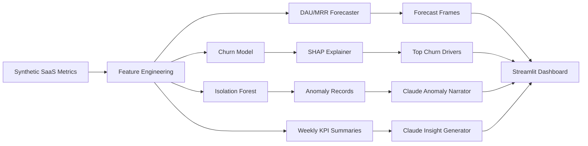

# PulseBoard

[](https://www.python.org/)
[](https://streamlit.io/)
[](https://scikit-learn.org/)
[](https://plotly.com/python/)
[](https://www.anthropic.com/)

PulseBoard is an AI-powered Product & Business Analytics Intelligence Dashboard for SaaS metrics. It generates realistic product telemetry, runs forecasting and anomaly detection pipelines, explains churn drivers with SHAP, and turns weekly KPI movement into executive-ready narratives with Claude.


## What It Shows

- Synthetic SaaS data with 12 months of daily DAU, MAU, signups, churn, ARPU, MRR, feature adoption, NPS, A/B variants, retention cohorts, and injected KPI anomalies.
- ML pipeline with feature engineering, churn prediction, Isolation Forest anomaly detection, Prophet-first forecasting with a statsmodels fallback, and SHAP feature attribution.
- LLM insight generation using the Anthropic Python SDK with graceful offline placeholders when `ANTHROPIC_API_KEY` is not configured.
- Streamlit dashboard with dark executive styling, KPI cards, forecast overlays, anomaly narratives, cohort heatmaps, and weekly insight feed.

## Architecture



## Quickstart

```bash
cd pulseboard
python -m venv .venv
source .venv/bin/activate
pip install -r requirements.txt
cp .env.example .env
streamlit run dashboard/app.py
```

Claude calls are optional. Without an API key, the app displays deterministic fallback summaries so the full dashboard remains runnable.

## Run The ML Pipeline

```bash
cd pulseboard
python scripts/run_pipeline.py
```

The CLI prints detected anomalies, DAU/MRR forecasts, churn model metrics, SHAP drivers, and LLM/offline insight text.

## Test

```bash
cd pulseboard
pytest
```

## Tech Stack

- **App:** Streamlit, Plotly
- **Data:** pandas, NumPy
- **ML:** scikit-learn, Prophet with statsmodels fallback, SHAP
- **LLM:** Anthropic Python SDK, async request wrappers
- **Testing:** pytest, pytest-asyncio

## Repository Layout

```text
pulseboard/
├── README.md
├── requirements.txt
├── .env.example
├── config/
│   └── settings.py
├── data/
│   └── generators/
│       └── synthetic_data.py
├── ml/
│   ├── pipeline.py
│   ├── anomaly_detector.py
│   ├── forecaster.py
│   └── explainer.py
├── llm/
│   ├── insight_generator.py
│   ├── anomaly_narrator.py
│   └── prompt_templates.py
├── dashboard/
│   ├── app.py
│   ├── components/
│   │   ├── kpi_cards.py
│   │   ├── trend_charts.py
│   │   ├── anomaly_panel.py
│   │   ├── cohort_heatmap.py
│   │   └── insight_feed.py
│   └── layout.py
├── tests/
│   ├── test_pipeline.py
│   ├── test_anomaly_detector.py
│   └── test_insight_generator.py
└── scripts/
    └── run_pipeline.py
```

## Configuration

Configuration is centralized in `config/settings.py` and can be overridden through environment variables:

- `ANTHROPIC_API_KEY`
- `ANTHROPIC_MODEL`
- `PULSEBOARD_RANDOM_SEED`
- `PULSEBOARD_HISTORY_DAYS`
- `PULSEBOARD_FORECAST_HORIZON_DAYS`
- `PULSEBOARD_ANOMALY_CONTAMINATION`

## Portfolio Notes

PulseBoard is intentionally designed as a senior DS/AI portfolio project: it demonstrates realistic metric simulation, production-shaped ML components, async LLM integration, testability, and a polished analytics UX without relying on proprietary data.
